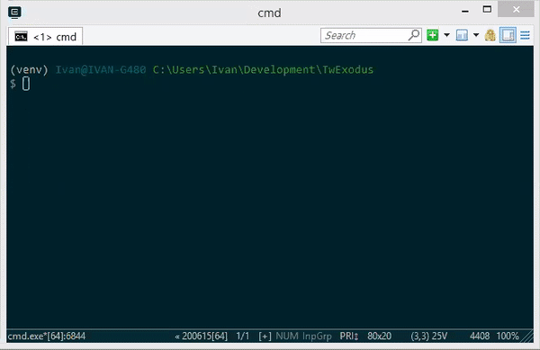

# TwExodus
Twitter application to mass contact your followers.

Created for [Twitter Export](https://github.com/balajis/twitter-export) bounty.

## Understanding of the problem
With the strong network effects Twitter currently presents as a platform, Twitter will closely prevent any attempt at migrating your user base to another service.

Of course, this protective behaviour is against your interests as Twitter user, along with the difficulty of contacting users *without their explicit consent*. This last point is really important as there are legal risks associated with this specific aspect of user contact.

## Proposed approach
The Mass DM solution seems to be the right path at contacting users, but it must be done in a stealth way. So building stealth techniques to the solution was my main focus at development.

Elaborating on the basic stealth techniques currently implemented there are 3 items that distinguish:
- Time randomization: Sleep script between a random amount of seconds per direct message sent
- Time window: Do not run after too late in the night, as in simulating an intern doing manual work
- Pool of predefined messages: Text file that contains predefined messages, to add noise and avoid detection. I recommend having at least 75-100 unique messages per 10k followers

There's of course a lot of room for improvement for this specific implementation, here are some ideas:
- Usage of K8s instances for spawning different IP addresses
- Alternating set of authorized API keys
- Run at random times of the day with short bursts
- Reverse engineering authorized apps and debugging memory space or attack with a man-in-the-middle technique the SSL/TLS traffic to track API calls for exact traffic mimicking (this would require a custom/rooted Android build or a jailbroken iOS device)
- Usage of a mobile phone emulator with automated task jobs (i.e. Monkeyrunner) using the official Twitter application
- Among several other stealth techniques 

While it's possible to use web scrapers (e.g. Selenium) to navigate Twitter, it was my technical choice to avoid the usage of said technology, as in my experience I believe the functionality of web scrapers is far more prone to fail and require constant (almost daily) fine-tuning to work properly. I chose to use Twitter API wrappers because after all, as long as you use API keys from an already authorized application, Twitter should not be able to tell the difference, unless this script is abused mechanically. Pretty much the user has to keep this in mind while using this script.

I didn't explore the Affiliate Link solution as I am very limited in web development skills. With little modification, it can be made compatible with that approach, as the `screen_name` (username) field is already in scope for string concatenation when you send the private direct message.

A long term solution would be to build proper analytics and community management tools on the top of the simplicity of Twitter. Pretty much like what Klout used to be. Yet, to supply an immediate market need given the existence of the other platforms (Substack, Ghost, Locals and the like) it's best to support the migration of the follower base.

---

## Technical features
- Retrieve followers and store these records in the `followers` table, both in online and offline mode
- Mass DM with randomized direct messages out of your pool of predefined messages
- Parsing of received email addresses in direct messages 

## Requirements
- Basic knowledge of command line usage
- Basic knowledge of virtual environments in Python
- You must have `consumer_key` and `consumer_secret` from an already authorized application

## Instructions
1. Navigate to the cloned repository directory
2. Create a virtual environment (e.g. `$ python -m venv venv`)
3. Activate the virtual environment (e.g. `$ source venv/bin/activate`)
4. Install package requirements (e.g. `(venv) $ pip install -r requirements.txt`)
5. Authorize your Twitter account following these instructions: [Medium article](https://medium.com/@fbilesanmi/how-to-login-with-twitter-api-using-python-6c9a0f7165c5)
6. Duplicate file `tw_config_sample.py` into `tw_config.py` replacing with your custom values
7. Run the `initialize.py` script as this will create the empty database
8. Run the `retrieve_followers_online.py` script as this will populate the `followers` table with your Twitter account followers, alternatively you could use the `retrieve_followers_offline.py` if you have a `follower.js` file in the `input` directory
9. You might want to change `priority` fields in the `followers` table with an SQLite 3 editor/client
10. Customize your direct messages file in `input/messages.txt`, you can either have affiliate links or you could request email addresses
11. Run the `send_mass_dm.py` script whenever you're ready, every day
12. If you requested email addresses instead of sending affiliate links, you can use the `parse_dump_emails.py` script to parse email addresses from direct messages and dumping them in a CSV file in the `output` directory

## Implementation
- Developed with **Python 3.8.3**
- Works with **SQLite 3**

## Nice to have's for the future
- Several sets of API keys
- Machine learning message generator, for added noise
- Desktop/On premises *native* application
- Markov chain or AI text generator to provide even more variety of messages to send as DMs
- Timezone detector of the follower instead of using the timezone of the main account
